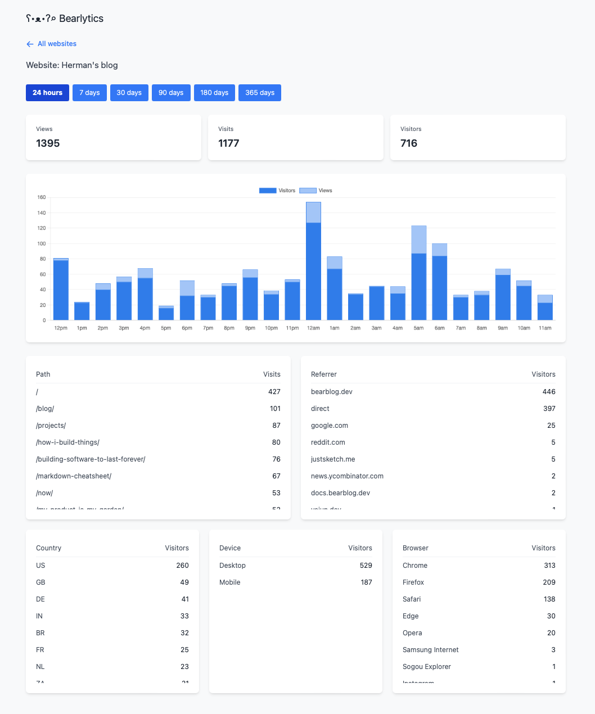

# Bearlytics


Privacy-first, no-nonsense web analytics.

## What is this?

Bearlytics is exactly what it says on the tin - a straightforward web analytics tool that helps you understand your website traffic without selling your soul to the tracking gods. No cookies, no PII problems, just the basics:

- Page views
- Referrers
- Country
- Device type
- Browser

## Why?

Because sometimes you just want to know how many people visited your blog post about artisanal toast without signing up for an enterprise-grade solution.

After struggling to self-host popular open-source analytics platforms like Plausible and Umami (which require multiple services and complex setups), I decided to build something simpler and self-contained with Django and SQLite.


## Features

- 🔒 Privacy-focused: No cookies, no personal identifiable information
- 🚀 As many websites as your server can handle
- 📊 Clean, intuitive dashboard
- 🔍 Filter by date range, page path, and referrer
- 📱 Responsive design that won't make your eyes bleed
- 💾 Self-hosted, because your data belongs to you

### Configuration

Bearlytics uses a straightforward Django configuration with SQLite as the database. Key settings include:

- **Database**: SQLite with WAL journal mode and optimized cache settings for better performance
- **Environment Variables** (using .env in the dev environment):
  - `SECRET_KEY`: Django secret key
  - `SALT_SECRET`: Secret key used to hash PII
  - `DEBUG`: Set to False in production
  - `DB_PATH`: SQLite database location (default: /app/db/db.sqlite3)
  - `ALLOWED_HOSTS`: Comma-separated list of allowed hosts
  - `CSRF_TRUSTED_ORIGINS`: Comma-separated list of trusted origins

The SQLite database is configured with performance optimizations:
- Increased cache size
- Write-Ahead Logging (WAL) journal mode
- Normal synchronization mode

## FAQ

**Q: Is it production-ready?**  
A: I've been running it in production on my [personal blog](https://herman.bearblog.dev) (~50,000 page views/month), and [JustSketchMe](https://justsketch.me) (~150,000 page views/month) since November 2024. So far, nothing has exploded.

**Q: Is this better than Google Analytics?**  
A: For tracking your cat blog? Probably. For enterprise-level analytics needs? I'd recommend something more robust, like [Fathom](https://usefathom.com/ref/GMAGWL).

**Q: Will this make me rich and famous?**  
A: No, but it will tell you how many people read your blog post about getting rich and famous.

**Q: Do I need a cookie consent banner?**  
A: No, but you can add one if you want.

**Q: Can I use this for my business?**  
A: Yes, but if you want to offer it as a service to your customers, check out the [full license](LICENSE.md).

**Q: How is user privacy protected?**  
A: User privacy is protected by not storing any personal identifiable information (PII). The IP address is hashed alongside the user-agent, and the current date with SHA-256 using a salt string that is stored in the environment variables. Can this be reversed? Yes, but it would require a lookup table of all possible IP addresses, user-agents and dates, along with their corresponding salted hashes, and a computer the size of a small moon.

> The lookup table would need approximately 11,400 TB (or about 11.4 petabytes) of storage  
> This assumes:
> - All possible IPv4 addresses (4.3 billion)
> - 250 common user agent combinations (5 browsers × 5 OS × 10 versions)
> - 365 days of dates
> - 32 bytes per SHA-256 hash  
> Time to Generate:  
> Even at a rate of 1 million hashes per second, it would take about 12.4 years to generate the complete table (and then you'd have to query it). All so you can get a rough idea of which IP address visited your site.

**Q: What about back-ups/data exporting?**  
A: The database is stored in a SQLite database file on your server. You can back it up any way you want. I personally use a cron job to back it up to an S3 bucket every 24 hours.

**Q: Can I pay you to host my analytics?**  
A: No, but if it's something you're interested in, let me know by commenting on [this issue](https://github.com/HermanMartinus/bearlytics/issues/1), and I may add it to [the roadmap](ROADMAP.md).

## Self-hosting Guide

This is a basic Django app that can be deployed to any platform that supports Django. I've chosen Dokku for this guide because it's easy to set up and manage, and I'm familiar with it.

### Prerequisites

- A Dokku server
- Basic knowledge of terminal commands
- A cup of coffee

### Step 1: Dokku Setup 

```bash
# Create the app
dokku apps:create analytics

# Create persistent storage for SQLite
dokku storage:ensure-directory analytics
dokku storage:mount analytics /var/lib/dokku/data/storage/analytics:/app/data

# Set environment variables
dokku config:set analytics SECRET_KEY=your_very_secret_key_here
dokku config:set analytics DB_PATH=/app/data/analytics.db
dokku config:set DISABLE_COLLECTSTATIC=1
dokku config:set SALT_SECRET=your_very_secret_salt_here
dokku config:set DEBUG=False
```

### Step 2: Deploy

Add Dokku as a remote and commit and push your code
```bash
git remote add dokku dokku@your-server:analytics
git push dokku main
```

### Step 3: Add Your First Website

1. Visit `https://your-analytics-domain.com`
2. Create an account (if no user exists, the first user will be automatically promoted to admin)
3. Add your website
4. Copy the tracking script
5. Add it to your website's `<head>` section
6. Watch those sweet, sweet analytics roll in

## Tracking Script

```html
<script async defer src="https://your-analytics-domain.com/script.js" data-website-id="your-website-id"></script>
```

## License

I'm still figuring out the best license model for Bearlytics. For now, here's the plan:
- You can self-host and modify Bearlytics for your own use, no strings attached
- Commercial hosting or re-selling of Bearlytics requires a commercial license ([email me](mailto:herman@bearblog.dev))

For the full license text, see [LICENSE](LICENSE.md)

## Contributing

Pull requests are welcome. To be certain we're on the same page, please open an issue first to discuss what you would like to change.

## Acknowledgments

- Coffee ☕
- That one Stack Overflow answer that saved my life (you know who you are) 🙏
- SQLite (you're doing great!) 👌
- Emma (thanks) ❤️

---

Made with love and probably too much caffeine by [Herman Martinus](https://herman.bearblog.dev)